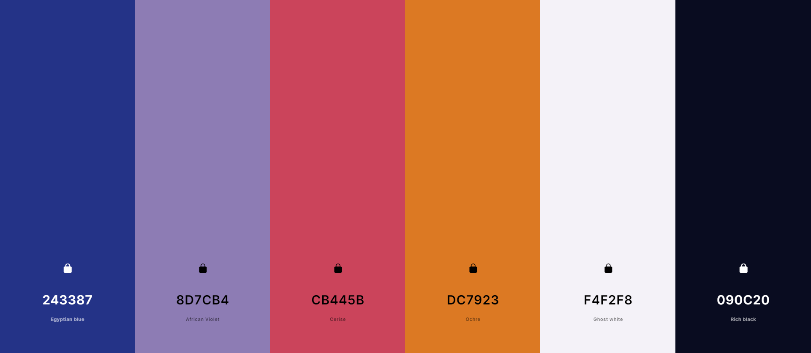
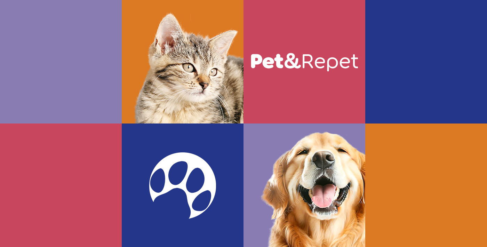
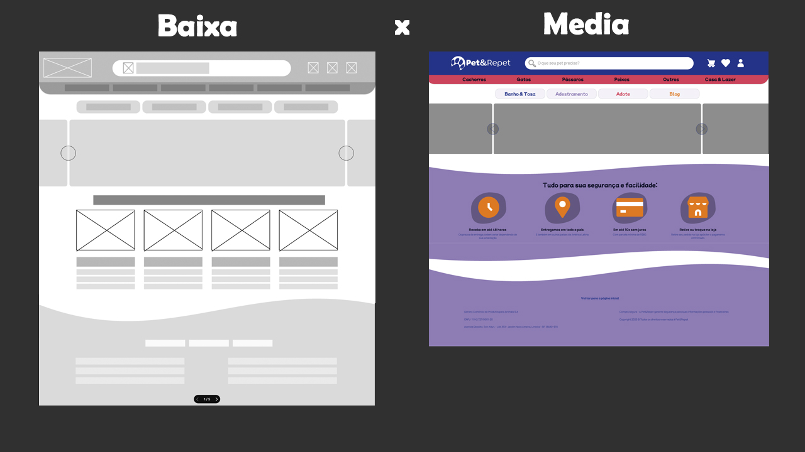
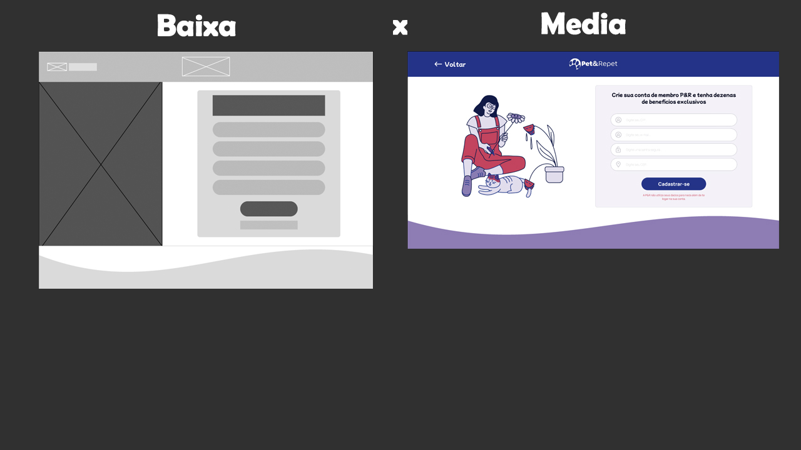
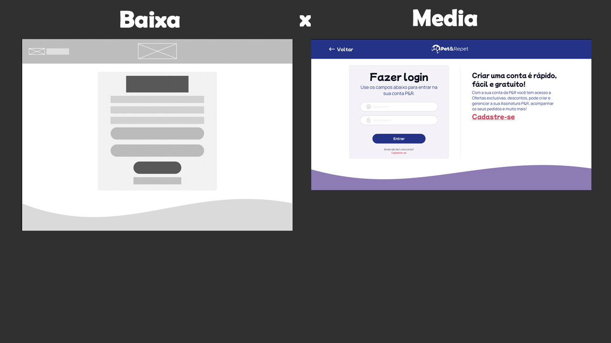

<h1 align="center">
    
    
O seu pet, nossa paixão: na Pet&Repet, cuidamos com amor e inovação! 🐾🦴

</h1>

## 🧾 Sobre :
A Pet&Repet é uma loja que trabalha com e-Commerce e, também, com consultas veterinárias on-line. Nossa empresa é feita para os pais de pets e até para profissionais da área. A empresa conta também com um sistema em que você mesmo pode se tornar um vendedor. A Pet&Repet está de portas abertas para todos os pets, desde que estejam devidamente dentro das leis.

## 🎨 Paleta de cores:
<h1>
    
     
    
</h1>

## Construção do site:

### Briefing:
Em primeiro momento os membros do grupo fizeram um **briefing**, que é um levantamento de ideias, afim de criar a estética primária do site, seu público-alvo, seus objetivos, etc...

### Prototipagem:
Após um levantamento das principais ideias, o grupo, foi iniciar o processo de criação do site utilizando o Figma como ferramenta de prototipagem. Dessa maneira foram feitas as prototipagem de baixa e média fidelidade.

**Comparação entre baixa e média fidelidade :**

#### Home:
<h1 align="center">
    
</h1>

#### Cadastro:
<h1 align="center">
    
</h1>

#### Login:
<h1 align="center">
    
</h1>

- **[Figma (baixa fidelidade)](https://www.figma.com/file/AIDQ3qp3zuQzFuQNLp8Rce/Untitled?type=design&node-id=0%3A1&mode=design&t=KijMigivXGFy6b1i-1)**

- **[Figma (media fidelidade)](https://www.figma.com/file/9a101RnrORnxLhzz9UTVYY/prototipo-media-fidelidade?type=design&node-id=0%3A1&mode=design&t=gx5TINVGloHioYf7-1)**
  

### Definindo as tecnologias:
Após fazer os protótipos decidimos dar mais um passo na criação das páginas, porém antes disso definimos o framework que utilizariamos para o projeto, o escolhido foi o React. O React foi escolhido por conta de alguns fatores como a sua componentização, sua reatividade e eficiência, sua grande abundância de recursos, etc... Também definimos nossa tecnologia para o back-End, e para isso escolhemos o NodeJS que é feito em javaScript.

### Resultado :
Por fim, o resultado nos deixou satisfeitos com nosso trabalho, nos certificamos de deixar todas as páginas responsivas, visualmente agradavéis, atrativas e acessíveis.

<h1>
    
</h1>

